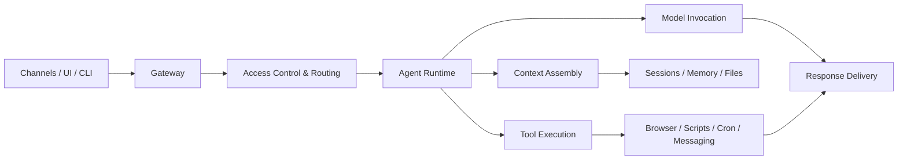

# OpenClaw in My Daily Life

### From chatbot to personal ops agent

Not just answering, but pulling context, prioritizing, reminding, and acting.

Meta-point: this deck was created with <b>OpenClaw</b> itself —
directly through the <b>OpenClaw TUI</b> in the live system.

Claus Käpplinger · short intro / ZeitgAIst round

<!--
Speaker notes:
- Keep the opening dry and practical: this is not a glossy product demo, but how I actually use OpenClaw.
- Set the meta-point early: the presentation itself was built through OpenClaw in the TUI.
- Goal: frame OpenClaw as an assistance layer, not just a chat window.
-->

---
layout: center
class: text-center
---

# The actual problem

Not too little AI. 
Too many open loops across too many channels.

  

    
Fragmentation

    WhatsApp, email, calendar, files, browser, reminders — everything lives separately.
  

  

    
Overwhelm

    The problem is often not missing information, but missing prioritization.
  

  

    
Friction

    Even small next steps die from context switching and micro-coordination.
  

<!--
Speaker notes:
- Don’t talk about AI yet. Talk about day-to-day coordination pain.
- My problem is not lack of tools, but too much coordination overhead.
-->

---
layout: two-cols
---

# Why I use it at all
## The personal version

- I have many parallel topics and channels open at the same time.
- My setup is intentionally <b>local-first</b> and spread across files, calendar, email, and chat.
- So I do not need a “smart chat”; I need something that helps me see <b>the next meaningful step</b>.

OpenClaw becomes interesting to me when it does not just sound smart,
but actually <b>removes mental load</b>.

::right::

  
What I want

  <ul class="mt-3 text-sm leading-7">
    <li>less context switching</li>
    <li>a clearer focus for the day</li>
    <li>small proactive nudges instead of tool chaos</li>
    <li>local data that does not get scattered everywhere</li>
  </ul>

Personal context: local-first knowledge system + focus on reducing overwhelm.

<!--
Speaker notes:
- This is the human reason.
- Don’t get overly personal; keep it pragmatic: too many projects, too many channels, not enough clear next steps.
-->

---
layout: center
class: text-center
---

# My thesis

OpenClaw becomes interesting when it sits 
between channels and action.

So not just: “prompt in, text out” 
but: chat + local data + tools + proactive execution

<!--
Speaker notes:
- This is the core one-liner slide.
- If time is short, problem + personal story + this slide is already a solid mini-talk.
-->

---

# The architectural idea behind it

  

    
1. Interfaces

    WhatsApp, Web UI, CLI, additional channels
  

  

    
2. Gateway

    ingestion, access control, routing, delivery
  

  

    
3. Runtime

    builds context, invokes the model, drives tools
  

  

    
4. State

    sessions, memory, files, reports, cron, browser
  

Inspired by Paolo Perrotta, <i>OpenClaw Architecture, Explained: How It Works</i>, especially the architecture overview and “Phase 2: Access Control & Routing”.

<!--
Speaker notes:
- Don’t go too deep here.
- The point is the separation of interface, control, runtime, and state.
- The model is only one piece; OpenClaw is the orchestration around it.
-->

---
layout: two-cols
---

# What I discovered during the research
## And want to try next

- While building this deck, it became clear to me that OpenClaw does not stop at personal assistance.
- Two patterns immediately felt relevant because they fit my setup directly.

That makes OpenClaw feel less like a single bot and more like a <b>platform for personal infrastructure</b>.

::right::

  
1. Self-Healing Home Server

  An agent monitors the home server, notices problems, and helps repair them instead of only screaming in alerts.

  
2. Multi-Agent Team

  Multiple specialized agents — for example strategy, dev, and marketing — with shared context and central coordination.

Further reading: 
<a href="https://github.com/hesamsheikh/awesome-openclaw-usecases/blob/main/usecases/self-healing-home-server.md" target="_blank">self-healing-home-server.md</a> 
<a href="https://github.com/hesamsheikh/awesome-openclaw-usecases/blob/main/usecases/multi-agent-team.md" target="_blank">multi-agent-team.md</a>

<!--
Speaker notes:
- This is your “there is much more here” slide.
- Good phrasing: while building the presentation, I realized I do not just want an assistant; I probably also want an agentic home server and later a small agent team.
-->

---
layout: two-cols
---

# Example 1
## Daily steering through WhatsApp

- I can simply write: “What matters today?”
- OpenClaw pulls <b>local calendar context</b>
- in my setup that runs through <b>vdirsyncer + khal</b>
- the goal is not just listing events, but giving me <b>one real focus for the day</b>

Not: “Here are your appointments.” 
But rather: “You have 3 fixed blocks — in between, exactly one meaningful work goal.”

::right::

  
What matters today?

  
2:00 PM university elections with IT 3:00 PM ZeitgAIst: Open Claw 8:30 PM introductory THW meeting  In between: one real work goal, not five.

Source (own practice): local calendar via <b>vdirsyncer/khal</b>; focus on real commitments.

<!--
Speaker notes:
- This is a real small everyday moment.
- Important framing: not “the bot lists appointments”, but “it helps me prioritize”.
-->

---
layout: two-cols
---

# Example 2
## Proactive assistance on WhatsApp

- daily <b>check-ins</b>, <b>shutdowns</b>, and <b>reminders</b>
- not only on request, but also <b>at the right time</b>
- with guardrails: a dedicated bot account is interactive, the main channel is more controlled
- that turns AI into an <b>assistance layer in daily life</b>

This is the actual jump for me: 
<b>from reactive chat to light proactive support for action.</b>

::right::

  
Daily check-in. Reply with 4 lines...

  
Bedtime ramp (15 min). Goal: devices OFF at 9:00 PM.

  
Quick check: what are you doing right now? Are you on your BIG 1?

Source (own practice): WhatsApp role model + daily cron/heartbeat check-ins.

<!--
Speaker notes:
- Use the examples instead of overusing the word “proactive”.
- Good phrasing: light support for action instead of annoying bot spam.
-->

---
layout: two-cols
---

# Example 3
## Email triage with a local pipeline

- there is a <b>local runner</b> for email triage
- results land in <b>reports</b>, not in some black box
- relevant emails are filtered and surfaced back briefly
- the goal is <b>less overwhelm and fewer context switches</b>

Not: “AI reads email.” 
But: <b>I can see faster what I actually need to react to.</b>

::right::

  
Local flow

  

    Inbox → triage runner → relevance schema → report → short feedback loop
  

  
<b>Concrete in my setup:</b>

  
~/openclaw/scripts/mail_triage_runner.py

  
~/openclaw/reports/mail-triage/

Source (own practice): local mail-triage runner in the OpenClaw workspace.

<!--
Speaker notes:
- Bridge this back to “AI as infrastructure”.
- Email triage is not LLM magic; it is pipeline + files + reports + return channel.
-->

---

# The meta layer: this deck was built with OpenClaw

  

    
1. Briefing

    idea and audience clarified in chat
  

  

    
2. Recall

    searched my personal memory DB for real examples
  

  

    
3. TUI

    created and iterated on the deck directly via the <b>OpenClaw TUI</b>
  

  

    
4. Build

    built it locally as a Slidev deck and exported a PDF
  

  

    
5. Delivery

    created a dedicated GitHub repo and pushed it
  

The nicest demo is almost the meta-demo: OpenClaw is not only being explained here — it was also the tool used to build, export, and publish this presentation through the TUI.

Repo: <a href="https://github.com/Clausinho/slidev-openclaw-talk" target="_blank">github.com/Clausinho/slidev-openclaw-talk</a>

<!--
Speaker notes:
- This is the mic-drop moment.
- If there is time, mention that the repo setup, PDF export, and Pages deployment were triggered out of the same workflow.
-->

---
layout: center
class: text-center
---

# My narrative in one sentence

OpenClaw is not just another smart chatbot for me,
but a personal runtime sitting between my channels and my next meaningful actions.

<!--
Speaker notes:
- This is your closing sentence.
- If anything in the talk gets wobbly, land here and close cleanly.
-->

---
layout: two-cols
---

# Links to take away
## Live + repo via QR

  

    
Live deck

    
<b>Link:</b> clausinho.github.io/slidev-openclaw-talk/

  

  

    
Repo

    
<b>Link:</b> github.com/Clausinho/slidev-openclaw-talk

  

QR is simply the pragmatic exit — nobody wants to type long URLs at the end.

::right::

  

    
Live deck

    
  

  

    
Repo

    
  

<!--
Speaker notes:
- Don’t sell here.
- Just say: if you want, you can open the live deck or grab the repo directly.
-->

---
layout: center
class: text-center
---

# Thanks

### If you want, I can show the WhatsApp / TUI / workflow part live afterwards.

<!--
Speaker notes:
- Calm ending.
- Good spoken last line: I’m happy to show a 2-minute live feel for how this works in practice.
-->
