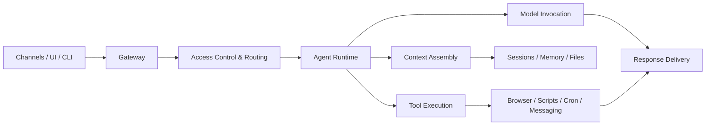

# OpenClaw in meinem Alltag

### Vom Chatbot zum persönlichen Ops-Agenten

Nicht nur antworten, sondern Kontext ziehen, priorisieren, erinnern und handeln.

Meta-Pointe: Dieses Deck wurde selbst mit <b>OpenClaw</b> erstellt —
und zwar direkt über das <b>OpenClaw TUI</b> im laufenden System.

Claus Käpplinger · Kurzvorstellung / ZeitgAIst-Runde

---
layout: center
class: text-center
---

# Das eigentliche Problem

Nicht zu wenig AI. 
Zu viele offene Schleifen in zu vielen Kanälen.

  

    
Fragmentierung

    WhatsApp, Mail, Kalender, Dateien, Browser, Erinnerungen — alles lebt getrennt.
  

  

    
Overwhelm

    Das Problem ist oft nicht fehlende Information, sondern fehlende Priorisierung.
  

  

    
Reibung

    Selbst kleine nächste Schritte sterben an Kontextwechseln und Mikro-Orga.
  

---
layout: center
class: text-center
---

# Meine These

OpenClaw wird spannend, wenn es 
zwischen Kanälen und Handlung sitzt.

Also nicht nur: „Prompt rein, Text raus“ 
sondern: Chat + lokale Daten + Tools + proaktive Ausführung

---

# Architektur-Idee dahinter

  

    
1. Interfaces

    WhatsApp, Web UI, CLI, weitere Channels
  

  

    
2. Gateway

    Ingestion, Access Control, Routing, Delivery
  

  

    
3. Runtime

    Kontext bauen, Modell aufrufen, Tools steuern
  

  

    
4. State

    Sessions, Memory, Files, Reports, Cron, Browser
  

Inspiriert von Paolo Perrotta, <i>OpenClaw Architecture, Explained: How It Works</i>, insb. Architekturüberblick und „Phase 2: Access Control & Routing“.

---
layout: two-cols
---

# Beispiel 1
## Tagessteuerung über WhatsApp

- Ich kann einfach schreiben: „Was ist heute wichtig?“
- OpenClaw zieht dazu <b>lokalen Kalender-Kontext</b>
- bei mir läuft das über <b>vdirsyncer + khal</b>
- Ziel ist nicht nur Terminanzeige, sondern: <b>ein echter Fokus für den Tag</b>

Nicht: „Hier sind deine Termine.“ 
Sondern eher: „Du hast 3 feste Blöcke — dazwischen genau ein sinnvolles Arbeitsziel.“

::right::

  
Was ist heute wichtig?

  
14:00 Hochschulwahlen mit IT 15:00 ZeitgAIst: Open Claw 20:30 Kennenlerntermin THW  Dazwischen nur ein echtes Arbeitsziel, nicht fünf.

Quelle (eigene Praxis): lokaler Kalender via <b>vdirsyncer/khal</b>; Fokus auf echte Commitments.

---
layout: two-cols
---

# Beispiel 2
## Proaktive Assistenz auf WhatsApp

- tägliche <b>Check-ins</b>, <b>Shutdowns</b> und <b>Reminder</b>
- nicht nur auf Anfrage, sondern auch <b>zum richtigen Zeitpunkt</b>
- mit Guardrails: dedizierter Bot interaktiv, Hauptkanal kontrollierter
- dadurch wird AI zu einer <b>Assistenzschicht im Alltag</b>

Das ist für mich der eigentliche Sprung: 
<b>von reaktivem Chat zu leichter proaktiver Handlungsunterstützung.</b>

::right::

  
Daily check-in. Reply with 4 lines...

  
Bedtime ramp (15 min). Goal: devices OFF at 21:00.

  
Kurz-Check: Was machst du gerade? Bist du auf deinem BIG 1?

Quelle (eigene Praxis): WhatsApp-Rollenmodell + tägliche Cron-/Heartbeat-Check-ins.

---
layout: two-cols
---

# Beispiel 3
## Mail-Triage mit lokaler Pipeline

- Für Mail-Triage gibt es bei mir einen <b>lokalen Runner</b>
- Ergebnisse landen als <b>Reports</b>, nicht in irgendeiner Blackbox
- Relevante Mails können gefiltert, gebündelt und kurz zurückgespielt werden
- Das ist vor allem ein <b>Overwhelm-Problem</b>, nicht nur ein NLP-Problem

Der Mehrwert ist nicht „AI liest Mails“. 
Der Mehrwert ist: <b>Ich sehe schneller, worauf ich wirklich reagieren muss.</b>

::right::

  
Lokaler Flow

  

    Inbox → Mail-Triage-Runner → Relevanzschema → Report → kurze Rückmeldung
  

  
<b>Konkret im Setup:</b>

  
~/openclaw/scripts/mail_triage_runner.py

  
~/openclaw/reports/mail-triage/

Quelle (eigene Praxis): lokaler Mail-Triage-Runner im OpenClaw-Workspace.

---

# Die Meta-Ebene: Dieses Deck wurde mit OpenClaw gebaut

  

    
1. Briefing

    Idee und Zielgruppe per Chat geklärt
  

  

    
2. Recall

    persönliche Memory DB nach echten Beispielen durchsucht
  

  

    
3. TUI

    das Deck direkt über das <b>OpenClaw TUI</b> erzeugt und iteriert
  

  

    
4. Build

    lokal als Slidev-Deck gebaut und als PDF exportiert
  

  

    
5. Delivery

    eigenes GitHub-Repo angelegt und gepusht
  

Die schönste Demo ist fast die Meta-Demo: OpenClaw erklärt hier nicht nur sich selbst — es war auch das Werkzeug, mit dem diese Präsentation über das TUI gebaut, exportiert und veröffentlicht wurde.

Repo: <https://github.com/Clausinho/slidev-openclaw-talk>

---
layout: center
class: text-center
---

# Meine Narrative in einem Satz

OpenClaw ist für mich kein weiterer smarter Chatbot,
sondern eine persönliche Runtime, die zwischen meinen Kanälen und meinen nächsten sinnvollen Handlungen sitzt.

---
layout: center
class: text-center
---

# Danke

### Wenn ihr wollt, zeige ich danach kurz den WhatsApp-/TUI-/Workflow-Teil live.
