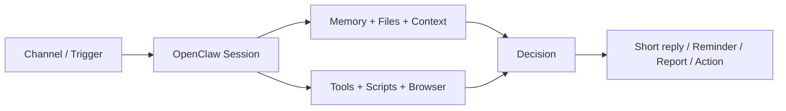

# OpenClaw in meinem Alltag

### Vom Chatbot zum persönlichen Ops-Agenten

OpenClaw ist für mich nicht interessant, weil es „ein LLM mit Chatfenster“ ist —
sondern weil es an echte Kanäle, lokale Daten und Workflows andockt.

Claus Käpplinger · Kurzvorstellung / ZeitgAIst-Runde

<!--
Hook:
Ich will nicht noch einen Chatbot. Ich will einen Assistenten, der in meinem echten Alltag operieren kann.
-->

---
layout: center
class: text-center
---

# Die Kernidee

Chat + Tools + lokale Daten + proaktive Ausführung 
statt nur Prompt rein, Text raus

  

    
Input

    WhatsApp, Webchat, Heartbeats, Cron, Dateien, Kalender, Mail
  

  

    
Kontext

    Verlauf, Memory, lokale Files, Tageskontext, persönliche Regeln
  

  

    
Aktion

    prüfen, priorisieren, erinnern, schreiben, triggern, zusammenfassen
  

  

    
Output

    kurze Nachricht, Reminder, Tagesfokus, Report, Follow-up
  

---
layout: two-cols
---

# Beispiel 1
## Tagessteuerung über WhatsApp

- Ich kann einfach schreiben: „Was ist heute wichtig?“
- OpenClaw zieht dazu <b>lokalen Kalender-Kontext</b>
- bei mir läuft das über <b>vdirsyncer + khal</b>
- Ziel ist nicht nur Terminanzeige, sondern: <b>ein echter Fokus für den Tag</b>

Nicht: „Hier sind deine Termine.“ 
Sondern eher: „Du hast 3 feste Blöcke — dazwischen genau ein sinnvolles Arbeitsziel.“

::right::

  
Was ist heute wichtig?

  
14:00 Hochschulwahlen mit IT 15:00 ZeitgAIst: Open Claw 20:30 Kennenlerntermin THW  Dazwischen nur ein echtes Arbeitsziel, nicht fünf.

Bezug: lokaler Kalender via <b>vdirsyncer/khal</b>, Fokus auf echte Commitments.

<!--
Memory reference:
Source: memory/2026-03-23
-->

---
layout: two-cols
---

# Beispiel 2
## Mail-Triage mit lokaler Pipeline

- Für Mail-Triage gibt es bei mir einen <b>lokalen Runner</b>
- Ergebnisse landen als <b>Reports</b>, nicht in irgendeiner Blackbox
- Relevante Mails können gefiltert, gebündelt und kurz zurückgespielt werden
- Das ist vor allem ein <b>Overwhelm-Problem</b>, nicht nur ein NLP-Problem

Der Mehrwert ist nicht „AI liest Mails“. 
Der Mehrwert ist: <b>Ich sehe schneller, worauf ich wirklich reagieren muss.</b>

::right::

  
Lokaler Flow

  

    Inbox → Mail-Triage-Runner → Relevanzschema → Report → kurze Rückmeldung
  

  
<b>Konkret im Setup:</b>

  
~/openclaw/scripts/mail_triage_runner.py

  
~/openclaw/reports/mail-triage/

<!--
Memory reference:
Source: memory/2026-03-23
-->

---
layout: two-cols
---

# Beispiel 3
## Proaktive Assistenz auf WhatsApp

- tägliche <b>Check-ins</b>, <b>Shutdowns</b> und <b>Reminder</b>
- nicht nur auf Anfrage, sondern auch <b>zum richtigen Zeitpunkt</b>
- mit Guardrails: dedizierter Bot interaktiv, Hauptkanal kontrollierter
- dadurch wird AI zu einer <b>Assistenzschicht im Alltag</b>

Das ist für mich der eigentliche Sprung: 
<b>von reaktivem Chat zu leicht proaktiver Handlungsunterstützung.</b>

::right::

  
Daily check-in. Reply with 4 lines...

  
Bedtime ramp (15 min). Goal: devices OFF at 21:00.

  
Kurz-Check: Was machst du gerade? Bist du auf deinem BIG 1?

Bezug: WhatsApp-Rollenmodell + proaktive Check-ins / Heartbeats.

<!--
Memory reference:
Source: MEMORY.md
Source: sessions/35419351-cdc1-4c2d-b1ee-bd249efc829c#L49-L64
-->

---

# Technisch gesehen

  

    
Interfaces

    <ul class="mt-3 text-sm leading-7">
      <li>WhatsApp</li>
      <li>Webchat</li>
      <li>Cron / Heartbeats</li>
      <li>Browser / lokale Files</li>
    </ul>
  

  

    
Reasoning Layer

    <ul class="mt-3 text-sm leading-7">
      <li>Session-Kontext</li>
      <li>Memory / Regeln</li>
      <li>Entscheidung: antworten, schweigen oder handeln</li>
    </ul>
  

  

    
Execution Layer

    <ul class="mt-3 text-sm leading-7">
      <li>lokale Scripts</li>
      <li>Dateioperationen</li>
      <li>Nachrichten / Reminder</li>
      <li>Berichte / Automationen</li>
    </ul>
  

---
layout: center
class: text-center
---

# Warum ich das spannend finde

Ich bekomme nicht einfach nur „mehr AI“,
sondern mehr Handlungskraft bei weniger mentalem Overhead.

Gerade bei Kalender, Mail, Priorisierung und Follow-ups ist das sofort praktisch.

---
layout: center
class: text-center
---

# Danke

### Wenn ihr wollt, zeige ich danach kurz den WhatsApp-/Workflow-Teil live.
